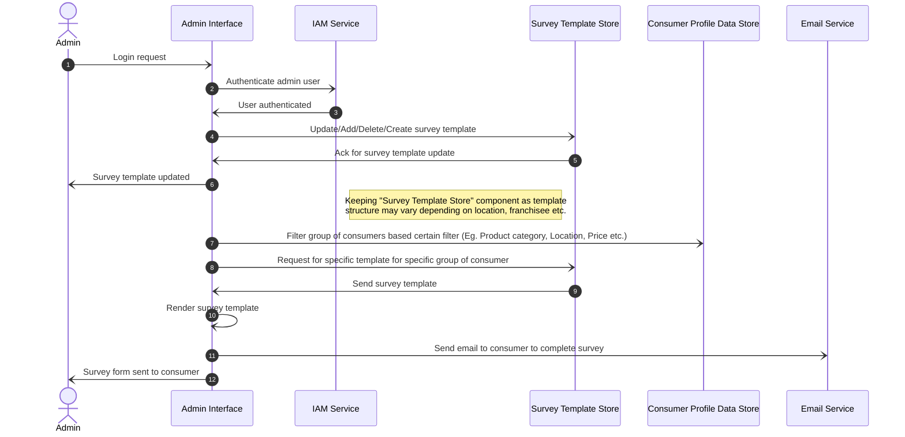

```mermaid

sequenceDiagram
    autonumber
    actor adm as Admin
    participant aui as Admin Interface
    participant auth as IAM Service
    participant sts as Survey Template Store
    participant cpds as Consumer Profile Data Store
    participant es as Email Service


    adm -) aui: Login request 
    aui -) auth: Authenticate admin user
    auth -) aui: User authenticated
    aui -) sts: Update/Add/Delete/Create survey template
    sts -) aui: Ack for survey template update
    aui -) adm: Survey template updated
    Note left of sts: Keeping "Survey Template Store" component as template <br>structure may vary depending on location, franchisee etc. 
    aui -) cpds: Filter group of consumers based certain filter (Eg. Product category, Location, Price etc.)
    aui -) sts: Request for specific template for specific group of consumer
    sts -) aui: Send survey template
    aui -) aui: Render survey template 
    aui -) es: Send email to consumer to complete survey
    aui -) adm: Survey form sent to consumer

```