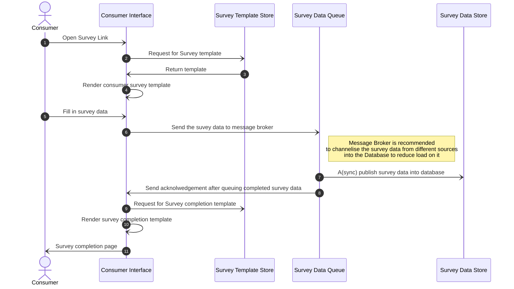

```mermaid

sequenceDiagram
    autonumber
    actor cns as Consumer
    participant cui as Consumer Interface
    participant sts as Survey Template Store
    participant sdq as Survey Data Queue
    participant sds as Survey Data Store


    cns -) cui: Open Survey Link
    cui -) sts: Request for Survey template
    sts -) cui: Return template
    cui -) cui: Render consumer survey template
    cns -) cui: Fill in survey data
    cui -) sdq: Send the suvey data to message broker
    Note right of sdq: Message Broker is recommended <br> to channelise the survey data from different sources <br> into the Database to reduce load on it
    sdq -) sds: A(sync) publish survey data into database 
    sdq -) cui: Send acknolwedgement after queuing completed survey data
    cui -) sts: Request for Survey completion template
    cui -) cui: Render survey completion template
    cui -) cns: Survey completion page

```
